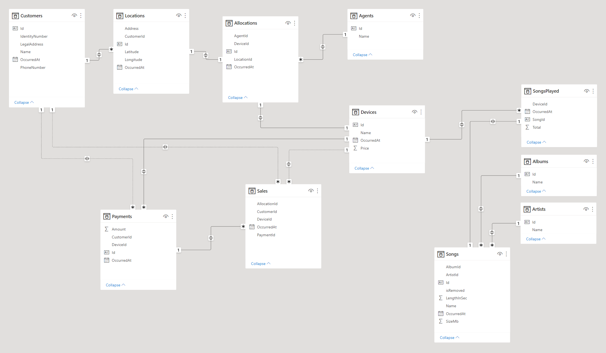

# JukeBox-Test-Case
## Context
As a leader of the Analytics team at Jukebox Inc, I've being asked to write a plan to solve a few `analytics challenges` that the company is facing:
1. Structure and link the tables in order to keep a clear record of `total sales` of jukeboxes.
2. Reward agents who sell devices which get `the most use` (as measured by songs played per month)
3. Understand cash flow and project it forwards:
    + a. `cash received/time`
    + b. `cash spent/time`
    + c. forecast of the above
    + d. `cash received` vs `expected cash received`
4. `Sales over time` for "MusicMaker3000" and comparison against other products
5. Make this production ready

The plan is to build a **scalable**, **clean** and **easy to use** *normalised* data model to help others to answer these questions avoiding the need of building multiple models in order to do so.

### Event List

Sale.CustomerRegistered
```json
{
  "CustomerId": "123",
  "CustomerName": "TESTNAME",
  "LegalAddress": "TESTADDRESS",
  "CustomerPhoneNumber": "TESTPHONE",
  "CustomerIdentityNumber": "TESTNUMBER",
  "OccurredAt": "01/01/01"
}
```

Sale.LocationRegistered
```json
{
  "LocationId": "123",
  "CustomerId": "456",
  "Latitude": "TESTLATITUDE",
  "Longitude": "TESTLONGITUDE",
  "Address": "TESTADDRESS",
  "ContactName": "TESTNAME",
  "ContactPhoneNumber": "TESTPHONE",
  "OccurredAt": "01/01/01"
}
```

Sale.DeviceAllocated
```json
{
  "DeviceId": "123",
  "LocationAllocatedId": "456",
  "SellingAgent": {
    "AgentId": "234",
    "AgentName": "TESTAGENT"
  },
  "DeviceDetails": {
    "DevicePrice": 2535,
    "DeviceName": "TESTNAME",
    "Id": "123",
  },
  "OccurredAt": "01/01/01"
}
```

Payment.PaymentReceived
```json
{
  "PaymentId": "123",
  "PaymentAmount": 640,
  "OccurredAt": "01/01/01"
}
```

Music.SongListened
```json
{
  "SongId": "123",
  "SongCompleted": true,
  "OccurredAt": "01/01/01"
}
```

Music.SongPublished
```json
{
  "SongId": "123",
  "SongDetails": {
    "ArtistName": "TESTNAME",
    "SongName": "TESTNAME",
    "AlbumName": "TESTNAME",
    "SongLength": 180,
    "SongSizeMb": 78,
  },
  "OccurredAt": "01/01/01"
}
```

Music.SongRemoved
```json
{
  "SongId": "123",
  "OccurredAt": "01/01/01"
}
```

Logistic.DevicePurchased
```json
{
  "DeviceId": "123",
  "DeviceDetails": {
    "DevicePrice": 250,
    "DeviceName": "TESTNAME",
    "Id": "123"
  },
  "OccurredAt": "01/01/01"
}
```

Knowing that we are going to receive multiple events (JSON format) into our warehouse, we could use jobs, tasks (stored procedures, dbt scripts) or other kind of data processing mechanism
to process these events and send the data to the respective tables within the model that we planning to build.

### Few assumptions prior building the model:
- We don't need to track **historical changes**
- Ids are integers, unique identifiers of an entity (i.e. a Customer) and these are going to be used as **primary keys**.\
*However, the best approach would be to implement a surrogate key in each dimensional table for a more robust model*

## Data model

| Customers |
|-------------|
| Id (PK) |
| Name |
| IdentityNumber* |
| PhoneNumber* |
| LegalAddress |
| OccurredAt |

*These fields can be considered PII data and we should examine if they are relevant for analytical purposes. If yes, we could obfuscate these columns using **dynamic data masking** in SQL.
Otherwise, the best would be to exclude these fields from the processing tasks.

Although CustomerRegistered event has properties like `CustomerName` we don't need to keep the word "Customer" in our table as it would be redundant.\
This approach will be used across all tables for this model.

| Locations |
|-------------|
| Id (PK) |
| CustomerId (FK) |
| Address |
| Latitude |
| Longitude |
| OccurredAt |

Locations are directly linked to Customers so it makes sense to have a column that stores a relationship to our Customers table.\
Also notice that we are not storing `ContactName` and `ContactPhoneNumber` from **Sale.LocationRegistered** event in our Locations table as this information is already stored in our Customers table\
*(assuming that contact and customer here have the same meaning)*

| Allocations |
|-------------|
| Id (PK) |
| LocationId (FK) |
| DeviceId (FK) |
| AgentId (FK) |
| OccurredAt |

In this case, we have allocations which are based on *locations* and *devices* hence we have a FK for both fields.
**DeviceAllocated** event tracks also `Agents`, however we don't want to store their data in the same table,\
 the best will be to create their own table and create a FK that we will use to reference to our agents if needed.

| Agents |
|-------------|
| Id (PK) |
| Name |

Even if it's a small table with just an *Id* and a *Name* column, it will help us to reduce data duplication.\
In the same way, we also have `DeviceDetails`. We will extract this information and create its own table.

| Devices |
|-------------|
| Id (PK) |
| Name |
| Price |
| OccurredAt |

Besides, we have a **DevicePurchased** event from our logistic domain that will provide device's information so it makes sense to centralise all this information into the same table.\
**Note**: The event has a property named `DeviceId` and a property `Id` inside the DeviceDetails object, I'm assuming that both are the same.

| Payments |
|-------------|
| Id (PK) |
| CustomerId (FK) |
| DeviceId* (FK) |
| Amount |
| OccurredAt |

**PaymentReceived** event is an interesting one. Payments are related to *customers* however the event itself doesn't contain any information about customers neither about devices.\
So it would be very difficult for us to identify who has made a payments without any of these properties within the event.

*The reason I would include `DeviceId` in this table is to create a *relationship between payments and devices*. At the moment payments are related to customers.\
So if a customer has more than one device we wouldn't be able to properly identify what device the customer is paying for.\
This enables us to track payments better and have an extra level of granularity.
(This is assuming that a customer can have more than one device at the same time, otherwise this wouldn't be necessary as payment will always be related to its device).

| Songs |
|-------------|
| Id (PK) |
| ArtistId (FK) |
| AlbumId (FK) |
| Name |
| LengthInSec |
| SizeMb |
| OccurredAt |
| isRemoved* |

| Artists |
|-------------|
| Id (PK) |
| Name |

| Albums |
|-------------|
| Id (PK) |
| Name |

| SongsPlayed |
|-------------|
| Id (PK) |
| DeviceId** (FK) |
| Total |
| SongCompleted*** |
| OccurredAt |

These tables are based on our *song related* events, things like `Artists` and `Albums` are moved to their own tables and I added a **FK** to the songs table so we can relate them back to the songs.\
*`isRemoved` is a field that covers the case where we receive a **SongRemoved** event, instead of removing the whole record from the table we could `softdelete` it and mark the value as **true or 1**,\
if in the future we add this song again we just need to change is value back to **false or 0**.

**Songs are *played from a device*, however the **songsListened** event does not have any property related to devices so
in order to know what device is playing these songs we will need to include at least `deviceId` to the event.

***`SongCompleted` property is not clear to me, is it a *boolean* that says if a song is completed? if that's the case we would write only to this table when the data from the events is relevant to us.

| Sales |
|-------------|
| AllocationId (FK) |
| CustomerId (FK) |
| DeviceId (FK) |
| PaymentId (FK) |
| OccurredAt |

Finally, our calculated **Sales** table. We don't have an event that tell us when a sale is made so we need *to generate* it ourselves from the events we receive.

The way to populate this table can vary, from a stored procedure to a dbt script that checks both of the conditions we have in order to make a sale.
An example of how we could build this table would be:

```sql
WITH Sales
AS (
    SELECT Allocations.Id,
		   Customers.Id,
		   Devices.Id,
		   Payments.Id,
		   IFF(Allocations.Ocurred At > Payments.OccurredAt, Allocations.OccurredAt, Payments.OccurredAt) AS SaleDate,
    FROM Allocations
	  INNER JOIN Locations ON Locations.Id = Allocations.LocationId
	  INNER JOIN Customers ON Customers.Id = Locations.CustomerId
	  INNER JOIN Devices ON Devices.Id = Allocations.DeviceId
	  INNER JOIN Payments ON Payments.DeviceId = Allocations.PaymentId --(this is if we can link payments to devices, otherwise the join would be with customerId)
	WHERE Payments.Amount > Device.Price
)
SELECT AllocationId,
	   CustomerId,
	   DeviceId,
	   PaymentId,
	   OccurredAt
  FROM Sales
```
### Data model
The model with all the relationships:



## Analytics Challenges

Now that we have the relational model in place we are able to answer the questions previously asked.
The easiest and fastest way to get these answers is to write SQL queries to get the results.
However, you can hook a BI tool to query the model and build your own reports as I demostrated using PowerBI.

1) Record of `total sales` of jukeboxes

```sql
SELECT COUNT(*) AS Sales
FROM Sales
```

2) Reward agent who `sold the most used device` (based on songs played by month)

```sql
SELECT Agents.Name,
	   MONTH(SongsPlayed.OccurredAt) AS [Month],
	   SongsPlayed.Total
  FROM Agents
    INNER JOIN Allocations ON Agents.Id = Allocations.AgentId
    INNER JOIN Device ON Allocations.DeviceId = Devices.Id
    INNER JOIN SongsPlayed ON Devices.Id = SongsPlayed.DeviceId
  GROUP BY Agents.Name,
	       MONTH(SongsPlayed.OccurredAt)
  ORDER BY SongsPlayed.Total DESC
  ```

- 3.1 `Cash received over time`

```sql
SELECT SUM(Amount) AS TotalCashReceived,
	   OccurredAt
  FROM Payments
  GROUP BY OccurredAt
```

- 3.2 `Cash spent over time`

```sql
SELECT SUM(Price) AS TotalSpent,
	   OccurredAt
  FROM Devices
  GROUP BY OccurredAt
```

- 3.3 `Forecast` of the above\
Is it a moving average a forecast? do they want a linear regresion? for this particular point it would be better to speak with Finance team and get alignment on the expectations around forecasts, so that we all talk about *ubiquitous language* when it comes to forecasting.
This is the point where we'll benefit from talking with Data Scientists and learn from them. However, assuming that I cannot get help from anyone and I have to do this task by myself I would go for
the **moving average calculation** as I think this calculation will bring a good perspective of the cash received/spent along the time. Giving us the opportunity to foresee possible trends.
This two scripts are calculating a 15 days moving average from each of the tables:
```sql
SELECT Amount,
       OccurredAt,
       AVG([Amount]) OVER ( ORDER BY [OccurredAt] ROWS BETWEEN 7 PRECEDING AND 7 FOLLOWING) FifteenDayMovAvg
FROM Payments
```

```sql
SELECT Price,
       OccurredAt,
       AVG([Amount]) OVER ( ORDER BY [OccurredAt] ROWS BETWEEN 7 PRECEDING AND 7 FOLLOWING) FifteenDayMovAvg
FROM Devices
```

- 3.4 `cash received` vs `expected cash received`\
 If we consider expected **cash received** as the minimum cash received to cover the cost of the **device** we could make a calculation to get the `net cash`.\
 Then if the value is negative, that means the payment done to the account is not enough to cover the cost of the device so at least another payment has to be done.

```sql
SELECT SUM(Amount) - SUM(Price) as NetCash
	   Payments.OccurredAt
  FROM Payments
    INNER JOIN Devices ON Devices.Id = Payments.DeviceId
  GROUP BY Payments.OccurredAt
```

4) `Sales over time` for "MusicMaker3000" and comparison against other products
```sql
SELECT COUNT(*) AS Sales,
	   Devices.Name,
	   Sales.OccurredAt,
  FROM Sales
    INNER JOIN Devices ON Device.Id = Sales.DeviceId
  GROUP BY Devices.Name, Sales.OccurredAt
  ```

5) Make this `production ready`\
In order to make this model production ready there are a few questions to be clarified which I think we should tackle as a team first:
- Can customers have more than one location?
- Payments are linked to customers, what about devices? can we link payments to devices?\
At the moment, **PaymentReceived** event doesn't have any property that tell us who has made the payment. We will need to talk to the backend team reponsible of the payment events
and find a way to include any sort of customer/device reference.
- We have a similar case with the **songsListened** event, we don't have a way from the event to link what devices has played the song.\
I will need to understand if this is on purpose on we are missing something.
- Is it possible to make a payment for a device that is not allocated?

Once we have clarified all doubts and we have a better understanding of the whole process, we should be able to build a pipeline in a development environment which we will use to
test our solution end to end.

Before writing to the data warehouse we should do some **data validation** so we only write data that is relevant to us.
For instance:
* Payments made can't be negative
* LocationRegistered event doesn't have a CustomerId property
* All devices should have a price

Knowing that we will have all the infrastructure in place, our job will be to set up a pipeline to deploy all the scripts required to build the tables and the jobs/tasks in charge of processing the data.
We could use tools like `dbt` that allow us to test the model and add these scripts as part of our pipeline, check thing like **unique** or **null** values and **relationships**.

Once we have everything deployed, we could do a dry run of the whole process from generating the events to populate the model in the warehouse.
In order to identify possible issues during this process it would be a good idea to add **monitoring** in order to get direct insights about what's it's happening.
i.e. we failed to write a record into the warehouse because a key was missing, we should be able to track that down.

Another point to consider will be **performance**, we should analyse writing performance and reading performance.
- *Writing performance* will determine how fast we can write to the model based on the data we receive
- *Reading performance* is related to how efficent and fast we can query the data
This process can help us to double check our indexing strategy or the way we struture the data.

Finally, another point to take into account will be showing and sharing our model with the teams that are going to consume it. Explain what we have done, how they can use it,
and let them play with it by themselves. Sometimes others will bring questions or cases we haven't thought about so it's a good trial for us.
Besides, if they are using tool like `Looker` to grab data from the model is a good time to test things like **connectivity**, **permissions**, **security**, etc.
Having monitoring helps a lot here, so we can track a "real" usage of our model.

If after all these steps we are happy with the results, we should be able to replicate our pipeline in a production environment painlessly.

A nice thing to have would be to setup **alerting** around our writes so we have this extra level of visibility around our pipeline.\
i.e. receive a notification when:
- Failed to write into one of the tables.
- Timeout connections. Connections failed.
- Failed to process an event because a property is missing.